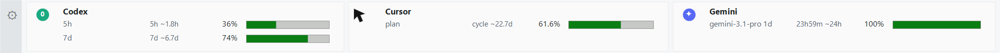
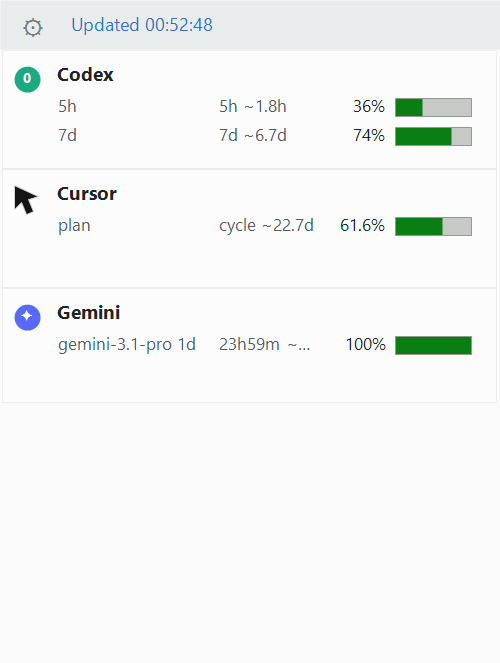
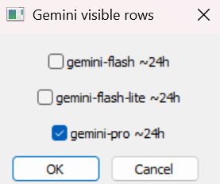

# LimitDock

LimitDock is a compact Windows desktop dock that shows remaining agent quota at a glance. It turns local usage/quota output into an always-visible desktop ribbon, focused on one thing: how much model quota is left, and when it resets.



## What It Shows

- Remaining quota only, grouped by provider, model or plan bucket, reset countdown, and percent.
- Codex rate-limit rows, including Spark labels exposed by openusage attributes.
- Cursor plan-cycle quota from `plan_percent_used` with `billing_cycle_end` reset text.
- Gemini model-specific quota rows, while suppressing aggregate duplicates when precise model rows exist.
- Antigravity quota rows from the LimitDock custom reader when local quota-like data is available.
- Exhausted or 0 percent rows, unless the user explicitly hides them.

LimitDock intentionally does not show spend, token totals, request counts, tool-call counts, or generic activity rows.

LimitDock is built on [openusage](https://github.com/janekbaraniewski/openusage). It is not a replacement for openusage: provider discovery, telemetry, and the read model belong there. LimitDock supervises the openusage daemon, reads its local read-model endpoint, normalizes quota-like rows, and renders them as a native Windows dock. Many thanks to the openusage maintainers for building the local usage/quota foundation this project depends on.

Provider support follows OpenUsage's upstream provider list where possible. See [openusage all providers](https://github.com/janekbaraniewski/openusage#all-providers). Providers listed there are handled through OpenUsage. Providers not exposed by OpenUsage can be added in LimitDock through Go reader adapters that emit the same internal read model.

## User Guide

### Ribbon Mode

Use `bottom` or `top` for a horizontal ribbon. Each provider card shows one or more quota rows. Row labels keep the model or plan bucket, including the metering window when openusage exposes it; the timing column shows only the reset countdown. When two rows are visible, they use two full-width lines; three or four rows use a compact grid. Long labels are shortened before reset time or remaining percent disappear.


### Side Dock

Use `left` or `right` for a vertical strip. Provider cards stack vertically and each quota row gets its own line.



### Visible Row Picker

Double-click a provider card to choose which model/window rows are visible. Hidden rows are never deleted and can be restored from the same picker.



### Tray Menu

Right-click the tray icon:

- `Hide Status Bar`: hides the dock, unregisters reserved mode, restores the Windows work area, disables hover reveal, and pauses refresh. Hide is session-only.
- `Show Status Bar`: restores the saved mode, edge, and pin state, then refreshes.
- `Settings`: opens docking, refresh, threshold, and provider path settings.
- `Exit`: closes LimitDock and stops the managed openusage daemon.

### Docking

LimitDock supports two display modes:

- `reserved`: the default first-run mode. It registers a Windows appbar and applies a matching work area so maximized windows leave room for the dock.
- `overlay`: floats above other windows. The pin icon appears only in overlay mode.

Edges are `bottom`, `top`, `left`, and `right`. You can change display mode and edge from `Settings`; docking choices are stored in local `settings.json`.

`Start LimitDock when Windows starts` is also in `Settings`. It writes a per-user `HKCU\Software\Microsoft\Windows\CurrentVersion\Run` value that points directly to `LimitDock.exe`, so no administrator rights or script launcher are required. Turn the checkbox off to remove the value.

Antigravity support is quota-only. If OpenUsage does not expose Antigravity, LimitDock tries its custom reader and renders a card only when it can read local percent/reset or prompt-credit quota data. It does not add an installation/status placeholder card.

## Install

1. Download the latest `LimitDock-<version>.zip` from GitHub Releases.
2. Extract the whole folder. Do not run `LimitDock.exe` by itself; it expects the icons, settings reference, and runtime folders beside it.
3. Run `LimitDock.exe`.

On first run, LimitDock downloads the official openusage Windows binary when it is not bundled. A local `settings.json` is created next to the app. The release includes `settings.example.json` as the portable configuration reference; personal `settings.json` files are never committed or shipped.

## Build From Source

Requirements:

- Go, for the native `LimitDock.exe` and release tool

```text
go test ./...
go build -ldflags "-H windowsgui" -o engine\bin\LimitDock.exe .\cmd\limitdock
go run .\cmd\limitdock-release -version vYYYYMMDD
```

The build creates:

- `dist\LimitDock-<version>\`
- `dist\LimitDock-<version>.zip`

The runtime app is Go-only. Legacy script app and probe files were removed after the migration.

## Documentation

- [User Manual](docs/USER_MANUAL.md)
- [Product Design](docs/PRODUCT_DESIGN.md)
- [Architecture](docs/ARCHITECTURE.md)
- [EXE Packaging](docs/EXE_PACKAGING.md)

## Repository Hygiene

Runtime databases, logs, PID files, downloaded openusage binaries, release folders, local Go caches, and `settings.json` are ignored. Keep `settings.example.json` as the shareable default.
