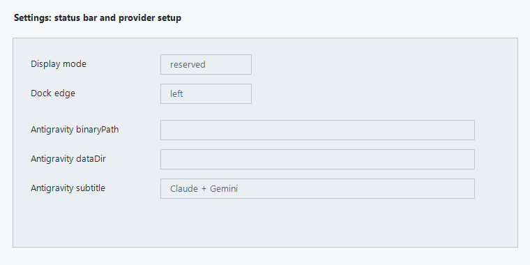

# User Manual

## Setup

Run LimitDock from the repository or release folder:

```powershell
powershell.exe -NoProfile -ExecutionPolicy Bypass -File .\run-limitdock.ps1
```

LimitDock starts OpenUsage.sh, reads the OpenUsage read model, and renders provider cards that have quota rows. On first run, OpenUsage.sh may be downloaded and the Go read-model probe may be built.

## Status Bar


Each provider card shows remaining quota by model/window. Rows include the shortest useful label available: model or plan bucket, metering window, reset countdown, and remaining percent.

Double-click a provider card to choose which rows are visible.

## Tray Hide And Show

Right-click the tray icon:

- `Hide Status Bar`: hides the bar, unregisters reserved mode, restores the Windows work area, disables hover reveal, and pauses refresh. This is not saved across launches.
- `Show Status Bar`: restores the saved mode, edge, and pin state, then refreshes immediately.
- `Settings`: opens configuration.
- `Exit`: closes LimitDock and stops the managed OpenUsage daemon.

## Docking Modes

Open `Settings`, then choose:

- `overlay`: floats above other windows. The pin icon appears in the tool rail.
- `reserved`: reserves a Windows work area.

Choose a dock edge:

- `bottom`
- `top`
- `left`
- `right`

Use Settings to change the selected edge. The selected edge is saved.
Left and right docking stack provider cards vertically. Quota rows render one per line for easier side reading.



## Quota Row Picker

Double-click any quota card to open the visible-row picker.


Checked rows are visible. Unchecked rows are hidden. Hidden rows are never deleted and can be restored by checking them again.

## Cursor

Cursor shows the plan-cycle quota row when OpenUsage exposes this billing-cycle metric:

- `plan_percent_used`

LimitDock displays the remaining percent and uses `billing_cycle_end` for reset text when present. Cursor spend, request, token, tool-call, and cost metrics are not shown.

## Gemini

When Gemini model-specific rows exist, LimitDock shows those rows and suppresses aggregate duplicates. This avoids generic rows such as bare `1d` when more precise model rows are available.

## Codex Spark

Codex `rate_limit_codex_bengalfox_*` rows are kept. When OpenUsage provides `rate_limit_codex_bengalfox_name`, LimitDock uses that display label, currently `GPT-5.3-Codex-Spark`.

## Antigravity Manual Setup

LimitDock does not add custom Antigravity quota parsing. Antigravity quota appears only if OpenUsage exposes it as a provider or quota-like snapshot.

Use Settings for manual hints:

- `antigravity.binaryPath`: Antigravity executable path when it is not on `PATH`.
- `antigravity.dataDir`: Antigravity or Gemini conversation/workspace root.
- `antigravity.subtitle`: manual label, for example `Claude + Gemini`.

If Antigravity still does not show quota, verify OpenUsage itself exposes Antigravity quota in its read model.

## EXE Launch

Run checks and build:

```powershell
powershell.exe -NoProfile -ExecutionPolicy Bypass -File .\scripts\check.ps1
powershell.exe -NoProfile -ExecutionPolicy Bypass -File .\scripts\build-release.ps1 -Version 0.1.0
```

Launch `dist\LimitDock-0.1.0\LimitDock.exe` when present. If `LimitDock.exe` is missing, install or import `ps2exe` and rebuild. Without ps2exe, the release folder still contains script launch files.
